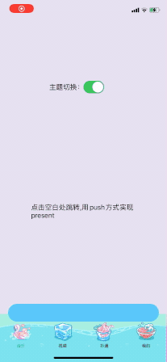

## 仿QQ音乐底部TabBar与播放条组合方案


上面的gif是从QQ音乐里使用的一段录屏，可以大致把这个组合实现方案归纳成下面三方面：

- 播放条与TabBar在层次结构的设计
- TabBar的主题设计
- 播放条与系统TabBar的三种结合模式（只显示播放条、播放条和TabBar都显示、都不显示）

### 播放条与TabBar在层次结构的设计：

首先，从观察QQ音乐实现的效果，抛出以下几个比较容易连想到的方案，再仔细的从每个方案中剖析：

1. 播放条放到最顶的window层，通过控制此播放条与TabBar的Frame，以及动画展示实现。
2. 播放条放到与TabBar同一层级的view内，Present VC需要隐式修改层级。
3. 播放条放到TabBar内部，自定义push转场模拟系统Present效果。

#### 1方案：此方案是联想到到全局悬浮窗的实现，但此方案存在以下缺点：

软件在运行时候，存在创建多个业务window（输入键盘、Alert、第三方组建创建的window、Present VC...), 而且在各个不同iOS系统版本，存在细微的层级结构差异，此时维护放在顶层window的播放条太麻烦，且存在隐患，毕竟新出的系统可能会调整window的结构。

点击播放条present出VC的效果没法实现，因为，系统Present出来的view层级是要比tabBar的视图层级要更高的，此时会覆盖掉TabBar，但同时播放条又是在window的最顶层，即TabBar与播放条之间被插入一个View，使得TabBar与播放条没法同时展示。

结论：pass1方案。

#### 2方案：

优点：能够跟随系统TabBar的视图层级，不需要额外处理部分业务产生的window（输入键盘，alert，第三方组件创建的window）。

缺点：Present VC的视图层级需要手动维护，且在多业务情况下，需要维护多个状态。

#### 3方案：

优点：能够跟随系统TabBar的视图层级，不需要额外处理部分业务产生的window（输入键盘，alert，第三方组件创建的window）。

缺点：代码量增多。。。


## 这里使用更加合理的3方案

1.通过KVC更改系统的tabBar为自定义的RootTabBar

```swift
rootTabBar = RootTabBar()
rootTabBar.RTDelegate = self
rootTabBar.itemsInfo = itemsInfo
rootTabBar.bgImg = tabBarBgImg
rootTabBar.createTabBarItems()
self.setValue(rootTabBar, forKey: "tabBar")
```

2.重写layout替换系统TabBarItem为自定义的RootTabBarItem

```swift
override func layoutSubviews() {
	super.layoutSubviews()
        
  for tempView in self.subviews {
      if (tempView.isKind(of: NSClassFromString("UITabBarButton")!)) {
          tempView.removeFromSuperview()
      }
  }
  
  // TabBarItems
  let layoutY = bottomBarStyle == .miniPlayViewOnly ? 
                                  miniPlayViewHeight + safeAreaBottomHeight : miniPlayViewHeight
  itemsContainer.frame = CGRect.init(x: 0, y: layoutY, width: screenWidth, height: tabBarHeight)
  let itemW = screenWidth / CGFloat(tabBarItems.count)
  for (index,barItem) in tabBarItems.enumerated() {
      barItem.frame = CGRect.init(x: itemW*CGFloat(index), y: 0, width: itemW, height: tabBarHeight)
  }
}
```

3.使用自定义转场替换系统的push转场

```swift
func navigationController(_ navigationController: UINavigationController, animationControllerFor operation: UINavigationController.Operation, from fromVC: UIViewController, to toVC: UIViewController) -> UIViewControllerAnimatedTransitioning? {
    if operation == .push {
        if toVC.currentPushOperation == .bottomUp {
            fromVC.isDelayShowBottomBar = false
            return PushAnimatedTransitionAsFromBottomToTop.init()
        }
    } else if (operation == .pop) {
        if fromVC.currentPushOperation == .bottomUp {
            toVC.isDelayShowBottomBar = true
            return PopAnimatedTransitioningAsFromTopToBottom.init()
        }
    }
    return nil
}
```

4.通过配置表BottomBarConfig中的NoneBottomBarList、AllBottomBarList 配置工程中哪些页面是属于什么类型（默认是只有一个miniPlayView）。于此同时，在基类vc中通过读取配置表，来更新当前vc的状态。

```swift
if let tabBarController = self.tabBarController as? RootTabBarController,  !self.isDelayShowBottomBar {
 tabBarController.updateBottomStyle(BarConfig.bottomBarStyleForViewControllerClass(Self.self))
}
```

## 效果



